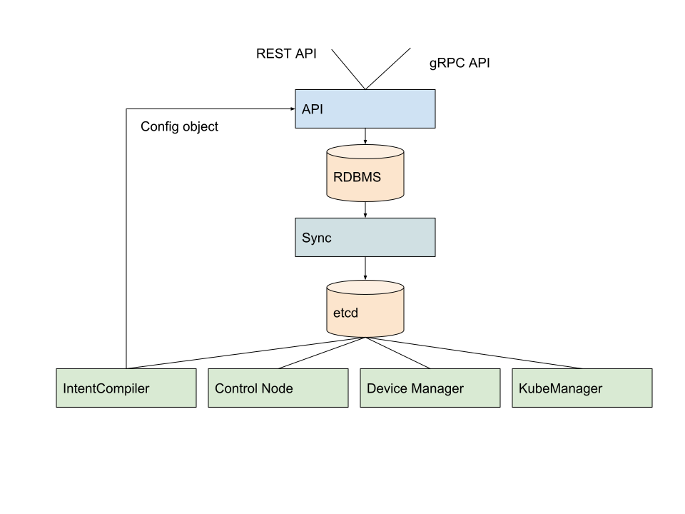
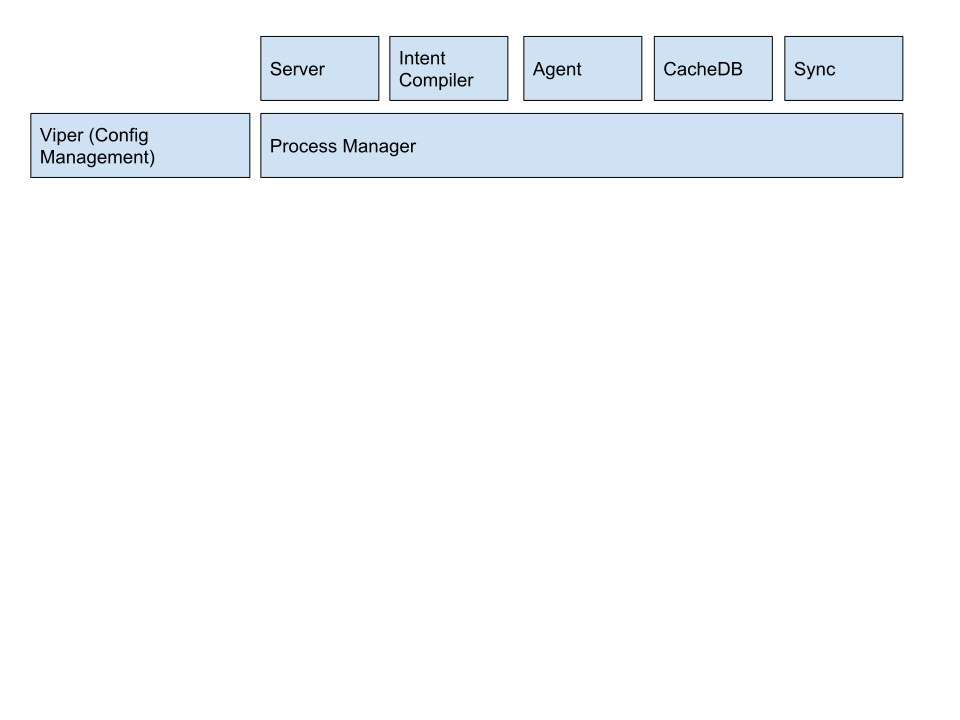
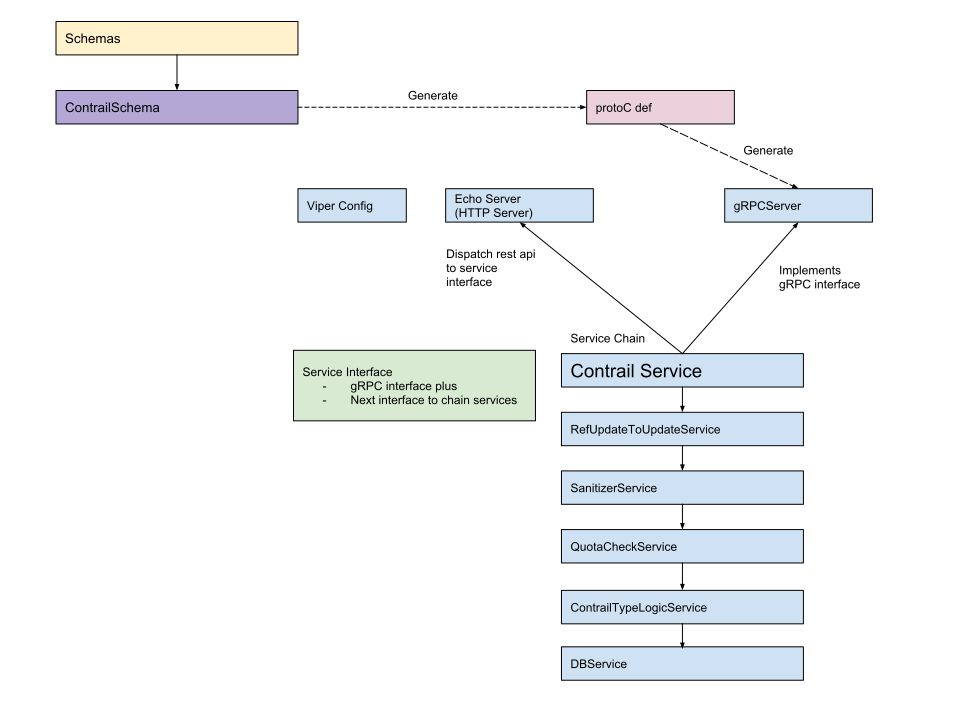

# Documentation index

- [Authentication](authentication.md)
- [Access Control](policy.md)
- [Validation](validation.md)
- [Services](services.md)
  - [Agent service](agent.md)
  - [API Server](rest_api.md)
  - [Cache Database](cache_db.md)
  - [Cluster service](cluster.md)
  - [Intent Compilation service](intent_compilation.md)
  - [Cassandra & AMQP Replicator services](replicator_services.md)
  - [Sync service](sync.md)
- [Deployment with k8s](k8s.md)
- Tools
  - [contrailutil](contrailutil.md)
  - [contrailschema](contrailschema.md)
  - [contrail cli](cli.md)

## Preface

This is a design document for refactoring Contrail using Go.
The goal of this change is to provide:

- Simpler architecture and operation experience
- Higher performance
- Data collections
- Maintainability

## Architecture

This diagram shows the overall architecture.

API Server provides REST API and gRPC API.
Internal logic depends on RDBMS and utilizes the power
of the relational model, so that developers can focus on implementing logic.
Sync process replicates RDBMS data to [etcd](https://github.com/etcd-io/etcd) using Replication mechanism.

Intent Compiler gets updates from etcd, evaluates configuration changes and dependency
and generates config object from the API resource model.

Existing Contrail processes such as Control Node, Device Manager,
Kube Manager will be capable of watching for any updates in etcd.



## Process management

[Cobra](https://github.com/spf13/cobra) is used to build CLI applications within project.

Show possible commands of application:

```bash
contrail -h
```

Show detailed information about specific command:

```bash
contrail <command> -h
```

### `Contrail` application

To simplify deployment, "single binary" approach is taken for Go-related project. Multiple micro-services are managed as goroutines and are run based on configuration flags, such as `sync.enabled`.
Processes communicate with each other using Service Interface (described below) so that it is possible to
switch between internal function call or gRPC call depending on where other processes are running.

`contrail` application contains following services (processes) spawned as separate goroutines:

- [Agent service](agent.md)
- [API Server](rest_api.md)
- [Cache Database](cache_db.md)
- [Cluster service](cluster.md)
- [Intent Compilation service](intent_compilation.md)
- [Cassandra & AMQP Replicator services](replicator_services.md)
- [Sync service](sync.md)



See: [Related source code](../pkg/cmd/contrail/run.go)

### Helper applications

Repository holds source code for following helper CLI applications:

- `contrailcli` - [API Server command line client](cli.md)
- `contrailschema` - [Code generator using schema definitions](contrailschema.md)
- `contrailutil` - [Utilities](contrailutil.md)

## Configuration

[Viper](https://github.com/spf13/viper) is used for configuration management. YAML is default configuration format. Every configuration option may be set via environment variable with `CONTRAIL_` prefix, e.g. `CONTRAIL_SYNC_ENABLED=true`.

CLI reads configuration from YAML file on path specified with `-c` / `--config` flag:

 ```bash
 contrailcli schema -c ./sample/cli.yml virtual_network
 contrailcli list -c ./sample/cli.yml virtual_network
 ```

Alternatively, `CONTRAIL_CONFIG` environment variable can be set to desired path:

 ```bash
 export CONTRAIL_CONFIG=./sample/cli.yml

 contrailcli schema -c virtual_network
 contrailcli list virtual_network
 ```

Sample configuration files are located in ["sample" directory](../sample).

## Schema

API schema is defined in multiple YAML files in ["schemas" directory](../schemas). Note that schema stored here is just a cache for development. Latest schema is located in [contrail-api-client repository](http://github.com/Juniper/contrail-api-client). JSON version of schema is generated [here](../public/schema.json).

Schema has following properties:

- id: unique schema ID
- extends: list of abstract schemas that defined schema extends
- parents: parent resources
- references: many to many relations
- prefix: REST API path prefix
- schema: JSON Schema

Sample schema:

```yaml
extends:
- base
id: virtual_network
parents:
  project:
    description: Virtual network is collection of end points (interface or ip(s) or
      MAC(s)) that can talk to each other by default. It is collection of subnets
      connected by implicit router which default gateway in each subnet.
    operations: CRUD
    presence: optional
plural: virtual_networks
prefix: /
references:
  network_ipam:
    $ref: types.json#definitions/VnSubnetsType
    description: Reference to network-ipam this network is using. It has list of subnets
      that are to be used as property of the reference.
    operations: CRUD
    presence: required
schema:
  properties:
    external_ipam:
      description: IP address assignment to VM is done statically, outside of (external
        to) Contrail Ipam. vCenter only feature.
      operations: CRUD
      presence: optional
      type: boolean
    fabric_snat:
      default: false
      description: Provide connectivity to underlay network by port mapping
      operations: CRUD
      presence: optional
      type: boolean
  required: []
  type: object
```

## Code generation

Generate source code and initial SQL definitions based on schema:

```bash
make generate
```

List of templates is specified in [Contrail templates configuration](../tools/templates/contrail/template_config.yaml) and [Neutron templates configuration](../tools/templates/neutron/template_config.yaml).

Project uses [Pongo2 template engine](https://github.com/flosch/pongo2) which is based on [Django template language](https://docs.djangoproject.com/en/dev/ref/templates/language/).

## Models

[Models package](../pkg/models) contains Go structs for all resource objects. All processes must
use this model. Note that one should avoid the use of the level objects such as JSON strings or
`map[string]interface{}`.
This package contains model-specific logic as well.

See: [Generated models documentation](proto.md)

## API Server

API Server provides REST API and gRPC API for external orchestrators such as UI, OpenStack or Kubernetes. [Echo](https://echo.labstack.com/) is used as HTTP Web server framework.



API Server supports Keystone V3 authentication and RBAC.

API Server has minimal embedded Keystone API V3 support for testing purposes. See "keystone" key [in sample configuration file](https://github.com/Juniper/contrail/blob/master/sample/contrail.yml).

See:
 
- [REST API documentation](rest_api.md)
- [Authentication documentation](authentication.md)
- [Policy documentation](policy.md)
- [API Server source code](../pkg/apisrv)

## Service Interface & Chain

To decouple logic from transport layer (gRPC, HTTP), "Service Interface" is defined. The Service Interface allows Service Chain concept to be used. Multiple services implementing Service Interface can be chained together, similarly to middleware pattern. For each service, "next" service needs to be set. Each layer of logic is expected to call `service.Next()` once, in arbitrary place. Calling service.BaseService provides additional check if "next" service is not nil.

Services does not act as middleware interceptors and returned value does not propagate to the next service, but it goes back to the caller.

`ContrailTypeLogicService` `CreateProject()` method implementation presenting `service.BaseService` usage:

```go
// CreateProject creates a project and ensures a default application policy set for it.
func (sv *ContrailTypeLogicService) CreateProject(
    ctx context.Context, request *services.CreateProjectRequest,
) (response *services.CreateProjectResponse, err error) {

    err = sv.InTransactionDoer.DoInTransaction(
        ctx,
        func(ctx context.Context) error {
            response, err = sv.BaseService.CreateProject(ctx, request)
            if err != nil {
                return err
            }

            return sv.ensureDefaultApplicationPolicySet(ctx, request.Project)
        })

    return response, err
}
```

## Services

See: [Services documentation](services.md)

## Kubernetes support

See: [Deployment for Kubernetes](k8s.md)

## Testing

Run all tests with coverage:

```bash
make test
```

Run all tests without coverage (faster, useful for local testing):

```bash
make nocovtest
```

Run all tests with additional debug information:

```bash
CONTRAIL_DATABASE_DEBUG=true make test
```

### Testutil package

`Testutil` package is located [here](../pkg/testutil). It contains helpers for automatic tests.
It contains also `integration` subpackage, which holds utilities and types used for integration testing. This package depends on internal packages, such as `pkg/apisrv` and `pkg/sync`.

### YAML integration testing toolkit

File [testutil/integration/common.go](../pkg/testutil/integration/common.go) contains integration testing toolkit, whose core object is `TestScenario` struct. Tests written with this toolkit are often called by developers "YAML tests". This name comes from the fact, that test scenarios are defined in YAML files containing custom structure.

YAML test toolkit reads test scenario from YAML files to `TestScenario` struct. It allows to:

- Define multiple Keystone users (`TestScenario.Clients`) to be used in HTTP requests (`Task.Client`).
- Specify list of paths of resources to delete before `TestScenario.Workflow` is started (`TestScenario.Cleanup`). One should specify cleanup paths for all resources created during `TestScenario.Workflow` to ensure test is performed in DB state.
- Perform multiple HTTP requests to API Server and check responses (`TestScenario.Workflow` which is list of `Task` objects).
- Specify etcd watchers both on `TestScenario.Watchers` level and `Task.Watchers` level. Each watcher entry holds a key the test is expecting events on (such as `/contrail/project/project_blue_project_uuid`) and list of values of events on that key.
- Enable Intent Compilation service within test scenario (`TestScenario.IntentCompilerEnabled`).

This toolkit is used in [API Server tests](../pkg/apisrv/server_test.go). Test scenarios are located in ["test_data" directory](../pkg/apisrv/test_data). Only API Server is tested here by performing various HTTP requests to it.

This toolkit is also used in [Contrail integration tests](../pkg/cmd/contrail/integration_test.go). Test scenarios are located in ["tests" directory](../pkg/cmd/contrail/tests). Those scenarios test not only API Server, but also Sync service, etcd and Intent Compilation service.

#### YAML quirks

FQName like this

```YAML
fq_name:
- "a"
- "b"
- ""
```

after unmarshalling will contain only 2 elements "a" and "b". If you want empty string define it using single quotes:

```YAML
fq_name:
- "a"
- "b"
- ''
```

